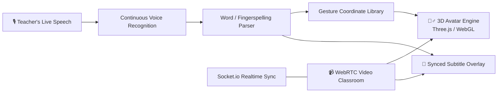

<div align="center">

# 🧍‍♂️ SignSpeak 3D

### Real-time speech-to-sign-language translation, brought to life in interactive 3D.

*Turning every spoken lecture into a 3D avatar students can orbit, zoom, and learn from — frame by frame.*

<sub>⚠️ Working title — rename freely, badges/URLs below are placeholders.</sub>

[](#)
[](#)
[](#)
[](#license)

</div>

<br/>

## 📖 Table of Contents

- [Overview](#-overview)
- [Why It Matters](#-why-it-matters)
- [Core Features](#-core-features)
- [How It Works](#-how-it-works)
- [Tech Stack](#-tech-stack)
- [Getting Started](#-getting-started)
- [Roadmap](#-roadmap--envisioned-features)
- [Contributing](#-contributing)
- [License](#-license)

<br/>

## 🌟 Overview

**SignSpeak 3D** translates spoken lectures into **real-time 3D sign language**, rendered through a fully interactive humanoid avatar. Instead of watching a flat 2D video where hand angles and finger depth get lost, students can **orbit, zoom, and rotate 360°** around the signer to see exactly how a gesture is formed.

It's built for two audiences at once: **Deaf and Hard-of-Hearing (DHH) students** following a live class, and **sign language learners** trying to master exact hand shapes and movement.

<br/>

## 🎯 Why It Matters

| Who | The Problem Today | How SignSpeak 3D Helps |
|---|---|---|
| 🧑‍🎓 **DHH Students** | Following audio-only lectures in real time is exhausting or simply inaccessible | Live speech is translated directly into 3D sign gestures + visual subtitles, no missed information |
| 🤟 **ISL/ASL Learners** | 2D tutorial videos obscure hand angles and finger depth | Interactive 3D avatar lets learners rotate 360° to see exact hand shapes and orientation |
| 🏫 **Remote/Hybrid Classrooms** | Hearing teachers and deaf students can't easily share one live lecture | Integrated video room runs assistive sign translation alongside the live call for everyone at once |

<br/>

## ✨ Core Features

| Feature | Description |
|---|---|
| 🎙️ **Real-Time Live Speech-to-Sign Mode** | Continuous voice recognition parses spoken sentences into words and letter fingerspelling, animating the 3D avatar live with synced subtitles |
| 🧍‍♂️ **Full 3D Interactive Avatar Engine** | High-fidelity humanoid rigs (Male & Female) built with Three.js/WebGL, with full orbit, zoom, and pan camera controls |
| 📁 **Custom 3D Avatar Upload** | Import your own `.glb` / `.gltf` character model for a personalized learning experience |
| 📹 **Collaborative Virtual Video Classroom** | Multi-user WebRTC + Socket.io classroom with video feeds, mic toggles, screen sharing, and Host/Viewer role assignment |
| 🔤 **Word & Alphabet Gesture Library** | Pre-programmed gesture coordinate dictionaries covering full dictionary words and letter-by-letter fingerspelling |

<br/>

## 🔄 How It Works



Speech is recognized continuously, parsed into words or individual letters, and matched against the gesture library — driving the 3D avatar's animation in real time while subtitles stay in sync, all layered on top of a live multi-user video classroom.

<br/>

## 🧰 Tech Stack

<div align="center">

| Layer | Technology |
|---|---|
| **3D Rendering** | Three.js, WebGL |
| **Avatar Assets** | `.glb` / `.gltf` humanoid rigs (custom upload supported) |
| **Live Classroom** | WebRTC, Socket.io |
| **Speech Input** | Continuous speech recognition engine |
| **Gesture Data** | Pre-built word + fingerspelling coordinate dictionaries |

</div>

<br/>

## 🚀 Getting Started

```bash
# Clone the repository
git clone https://github.com/<your-username>/signspeak-3d.git
cd signspeak-3d

# Install dependencies
npm install

# Configure environment
cp .env.example .env
# Add your speech recognition API key and Socket.io/WebRTC server config

# Run the app
npm run dev
```

<sub>Adjust these commands to match your actual project structure.</sub>

<br/>

## 🗺️ Roadmap — Envisioned Features

- [ ] 🤖 **AI Sign-to-Text Reverse Practice Camera** — MediaPipe hand-pose tracking grades a student's own signing in real time ("95% match on 'B' — tilt your thumb outward")
- [ ] 🐢 **Slow-Motion & Multi-Angle Replay Scrubbing** — 0.25x–0.5x playback, freeze-frame, and timeline scrubbing for complex signs
- [ ] 📝 **AI Lecture Summarizer & Flashcard Generator** — auto-captures lecture transcripts into study notes and sign-language vocabulary flashcards
- [ ] 🎮 **Gamified Quizzes & Daily Sign Streaks** — mystery-word sign games with badges, streaks, and progression levels
- [ ] 🌐 **Multi-Dialect Regional Sign Packs** — toggle between ASL, ISL, BSL, and other regional dialects
- [ ] 📄 **Offline Lesson PDF / Video Exporter** — export any lesson as a video clip or pictorial PDF for offline practice

<br/>

## 🤝 Contributing

Contributions, issues, and feature requests are welcome!

1. Fork the project
2. Create your feature branch (`git checkout -b feature/amazing-feature`)
3. Commit your changes (`git commit -m 'Add amazing feature'`)
4. Push to the branch (`git push origin feature/amazing-feature`)
5. Open a Pull Request

<br/>

## 📄 License

Distributed under the **MIT License**. See `LICENSE` for more information.

<br/>

<div align="center">

### 🌟 Built so no student misses a word — or a sign.

**If this project resonates with you, consider giving it a ⭐!**

</div>
